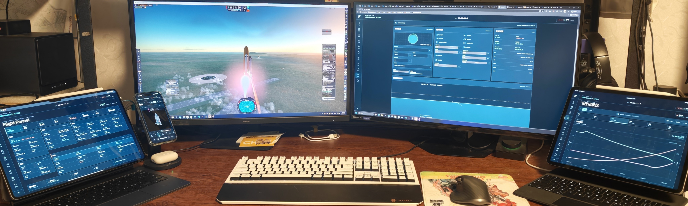
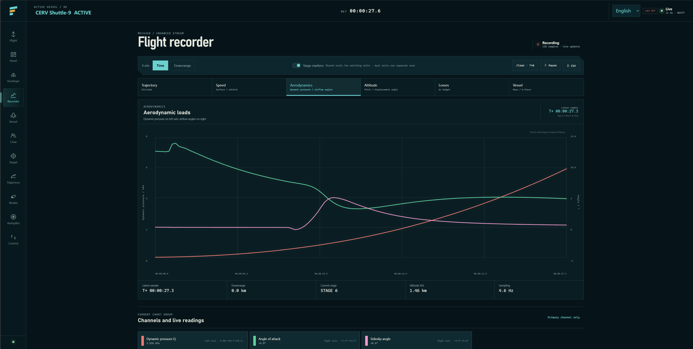
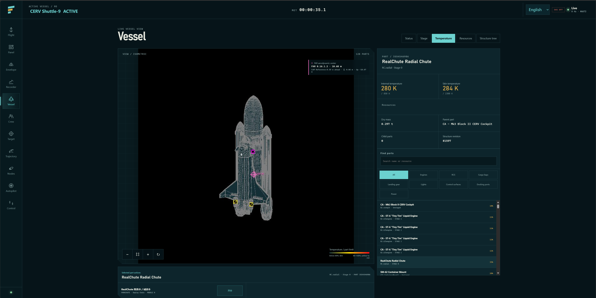
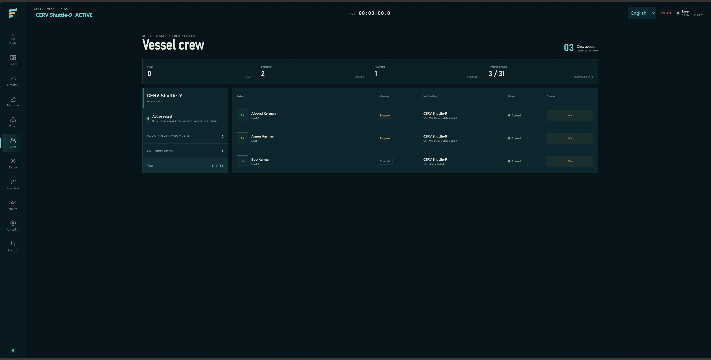
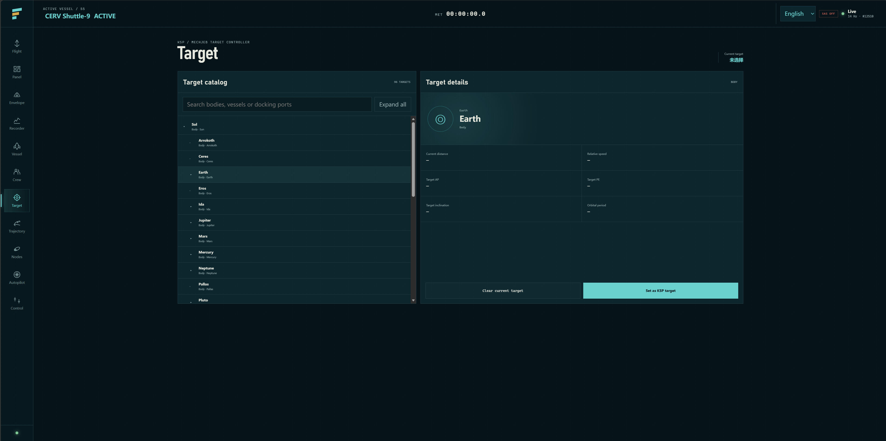
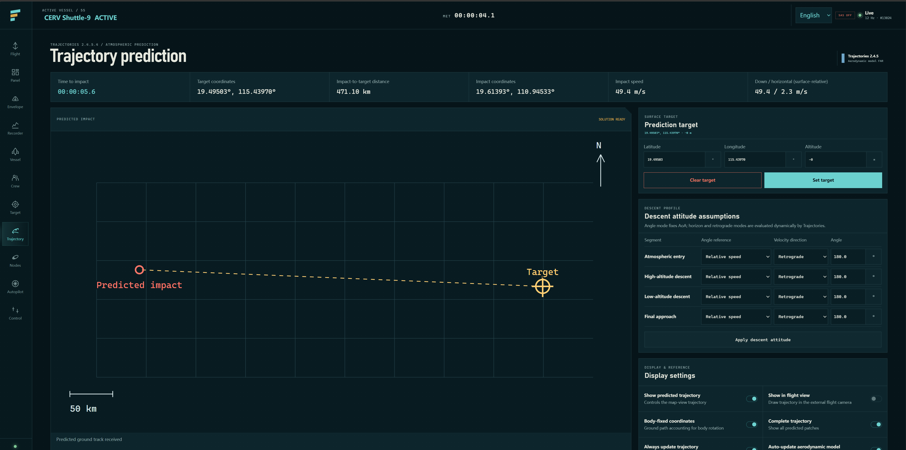
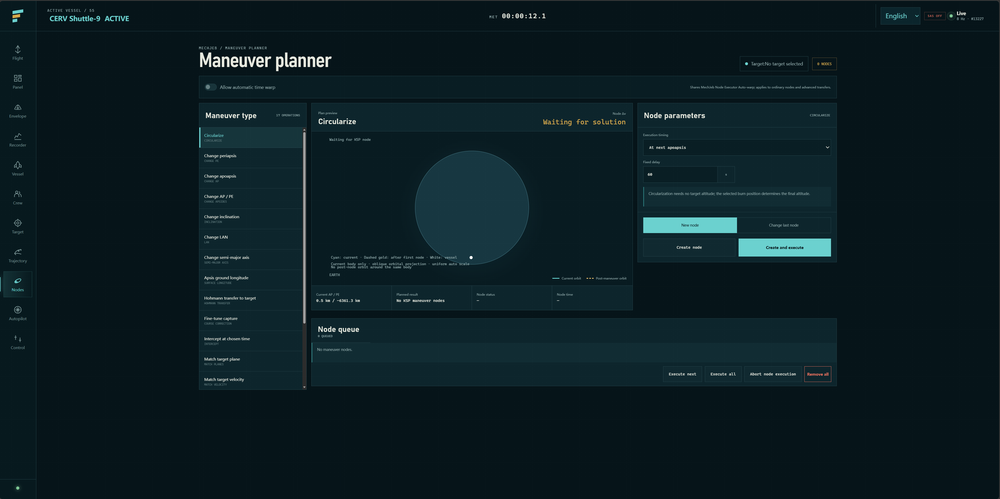
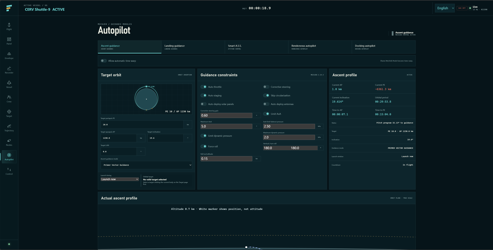
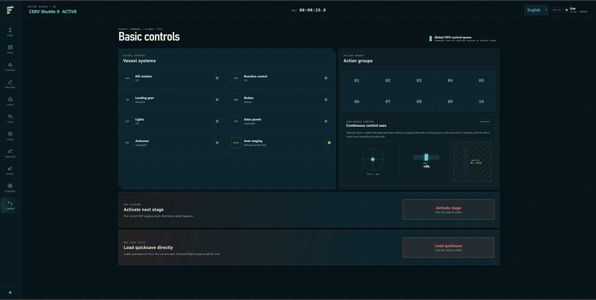

# Armor Control

A touch-friendly remote flight console for Kerbal Space Program.

KSP 1.12.5 · Version 0.1 · Early beta · CC BY-NC-SA

English | [简体中文](README.zh-CN.md)

[Downloads](https://github.com/Armo00/ArmorControl/releases) · [KSP Forum](https://forum.kerbalspaceprogram.com/topic/231740-1125-armor-control-v01/) · [Report a bug](https://github.com/Armo00/ArmorControl/issues)



## What is Armor Control?

Armor Control turns your phone, tablet, or another computer into a remote flight console for KSP. Monitor your vessel, operate its systems, plan maneuvers, and access supported autopilot functions through a web interface designed for touch and desktop use.

The HTTP/WebSocket server runs inside KSP. No separate server application, kRPC installation, or special Armor Control part is required. English and Simplified Chinese are available; Chinese is selected by default.

## Sounds familiar?

Yes! Armor Control was inspired by [Telemachus](https://github.com/TeaGuild/Telemachus-1) and the idea of bringing KSP mission control into a browser.

My goal is to develop that idea into a higher-performance, more versatile remote control and monitoring interface, combining live telemetry, vessel interaction, and mod integrations in one place. Performance is a development goal, not a claim of benchmarked superiority over Telemachus.

I also wanted to move frequently used controls onto another device, leaving the main KSP screen clear for the flight itself. Thank you to the Telemachus project for the inspiration.

## Attention needed

**Early beta:** Version 0.1 is experimental. Expect bugs, incomplete behavior, and compatibility issues. Back up your saves before testing.

### Dependencies

| Component | Requirement in 0.1 | Compatibility notes |
| --- | --- | --- |
| KSP | Required | Developed and tested with 1.12.5. |
| MechJeb | Required | Use **2.14.3**. Flight data, recording, planning, and automation integrate with MJ. |
| VesselView / Vessel Viewer | Required | The vessel renderer targets **0.8.9.0**. |
| Trajectories | Optional | Required for trajectory prediction; adapted to the local **2.4.5.4** assembly. |

MechJeb and VesselView are direct assembly dependencies in this release. Do not assume Armor Control will start normally without them, even if you only want basic controls. MJ functions also require an available MechJeb core on the active vessel.

I have encountered too many problems with MechJeb 2.15.x in my setup, so support is intentionally pinned to 2.14.3. Other MJ versions are unsupported. Other VesselView and Trajectories versions are not guaranteed to work. Dependencies are not bundled.

**Security:** Authentication is disabled by default, and traffic uses unencrypted HTTP/WebSocket. Use only on a trusted local network. Do not expose the server to the internet or forward its port through your router. An optional access token does not encrypt the connection.

**Multiple devices:** Devices share control of the same active vessel. Commands are processed in arrival order; there are no user roles or exclusive control ownership. Coordinate before operating. Staging, EVA, and quickloading affect the actual game.

**AI disclosure:** This mod was developed with AI assistance. If you do not want to use AI-assisted software, please do not use it.

## Installation and connection

Distribution is currently through [GitHub](https://github.com/Armo00/ArmorControl). SpaceDock and CKAN support are planned.

1. Install the required dependencies above.
2. Download the packaged release ZIP from [Releases](https://github.com/Armo00/ArmorControl/releases), not **Code → Download ZIP** or GitHub's automatically generated source archives.
3. Close KSP, extract the package into its installation directory, and merge the `GameData` folders.
4. Keep the complete `ArmorControl` directory, including the web files under `prototype` and its `Localization` folder.

The installed structure should include:

```text
KSP installation/
└── GameData/
    └── ArmorControl/
        ├── Plugins/ArmorControl.dll
        ├── prototype/
        │   ├── index.html
        │   ├── app.js
        │   └── Localization/
        └── settings.cfg
```

Armor Control is independent of ArmorOverhaul. When upgrading from an older integrated installation, remove only the old ArmorControl files and DLL to avoid duplicate loading. Do not remove unrelated ArmorOverhaul content.

### Open the console

Start KSP. The server starts automatically by default. Use the **ArmorControl toolbar button** to check its status, change the port, or start and stop the service.

| Device | Browser address |
| --- | --- |
| Computer running KSP | `http://127.0.0.1:8765` |
| Another device on the same LAN | `http://<KSP-computer-LAN-IP>:8765` |

For example, if the KSP computer's LAN address is `192.168.1.100`, open `http://192.168.1.100:8765` on the other device. Use the configured port if you changed it. Allow the port through the host firewall on trusted private networks if necessary.

Enter the Flight scene to see the active vessel's data. The console follows the active KSP vessel.

### Language

Use the upper-right language selector to choose **简体中文** or **English**. The choice is saved per browser and does not change other devices. The in-game server panel has its own language setting.

Contributors can edit the JSON catalogs in [`prototype/Localization`](prototype/Localization). See the [localization guide](prototype/Localization/README.md).

## Introduction: page by page

<details>
<summary>Flight — live instruments</summary>

A spacecraft-style navball with live attitude, altitude, speed, vertical speed, thrust, TWR, dynamic pressure, and essential orbital information.


</details>

<details>
<summary>Flight Panel — dense telemetry</summary>

Orbital, surface, performance, vessel, and flight data in a denser layout for larger screens. Includes heading, horizontal speed, angle of attack, sideslip, atmospheric pressure, biome, and suicide-burn countdown when available.


</details>

<details>
<summary>Flight Envelope — limits and engine protection</summary>

Access supported MechJeb settings for maximum dynamic pressure, maximum acceleration, minimum throttle, overheating protection, and automatic staging.


</details>

<details>
<summary>Flight Recorder — charts and history</summary>

Review altitude, speed, aerodynamics, attitude, losses, and vessel performance in separate chart groups. Switch between time and downrange distance, inspect historical samples, show staging markers, and export CSV data. Clearing the recorder starts a new recording at T+0.



</details>

<details>
<summary>Vessel — visualization and part controls</summary>

Inspect the vessel, select and highlight parts, and find engines, RCS, lights, landing gear, cargo bays, docking ports, and other systems through quick groups.

Supported actions include individual engine activation, thrust limiting, gimbal toggles, and selected part right-click actions. Depending on the part and mod, these include parachute deployment, radiator operation, decoupling, undocking, and converter controls. Compatible groups offer all-on/all-off controls. Heat visualization highlights parts approaching their thermal limits. Aerodynamic-center visualization includes FAR-aware handling where data is available.

Part action support is not universal; availability also depends on the current flight state.



</details>

<details>
<summary>Crew — the active vessel’s manifest</summary>

See who is aboard, which compartment each Kerbal occupies, and their profession. EVA is available when supported and requires confirmation.



</details>

<details>
<summary>Target — selection and relative motion</summary>

Browse celestial bodies and vessels through a hierarchical menu, select or clear a target, and inspect available target and relative-motion information.



</details>

<details>
<summary>Trajectory Prediction — impact data and ground map</summary>

Access Trajectories predictions, descent attitude assumptions, display options, and computation parameters. Available predictions show impact coordinates, time to impact, impact speed, and impact-to-target distance.

A north-up ground map displays the predicted path, impact point, and target, with automatic scaling and a distance scale. This page uses Trajectories’ prediction target; do not assume every target selected elsewhere in KSP is automatically copied into it.



</details>

<details>
<summary>Maneuver Planning — nodes and Porkchop selection</summary>

Create and manage nodes through supported MechJeb operations, each with its relevant parameters. Advanced transfers provide a Porkchop plot for comparing departure times, transfer durations, and delta-v costs.

Includes orbit previews, a node queue, execution and abort controls, and MechJeb automatic time-warp settings.



</details>

<details>
<summary>Autopilot — five MechJeb panels</summary>

- **Ascent Guidance:** supported ascent profiles, orbit targets, launch timing options, guidance constraints, and live ascent and orbital readouts.
- **Landing Guidance:** landing targets, guidance settings, prediction information, and automatic landing controls.
- **Smart A.S.S.:** attitude modes and editable offsets, with increment/decrement buttons and selectable angular steps.
- **Rendezvous Autopilot:** supported rendezvous settings and execution controls.
- **Docking Autopilot:** docking controls, axis selection, forced roll, and safe-distance and starting-distance overrides.



</details>

<details>
<summary>Basic Control — vessel systems and touch inputs</summary>

Operate vessel systems, action groups 01–10, throttle, and touch-based pitch, yaw, and roll. Staging and quicksave loading use slide-to-confirm interactions.

During MechJeb ascent, node execution, or automatic landing, manual web throttle control is locked. Attitude inputs remain available without automatically cancelling the MJ task.



</details>

## Troubleshooting and feedback

- **Cannot open the page:** check toolbar server status, port, host LAN address, firewall, and connectivity between devices. On a phone, `127.0.0.1` refers to the phone, not the KSP computer.
- **Page opens but data is unavailable:** check the Flight scene, active vessel, connection indicator, and dependencies.
- **MJ actions are unavailable:** check MJ 2.14.3, an active-vessel MJ core, and any required target or node.
- **A part action is missing:** the part, mod, or current flight state may not support it.

Please [report bugs on GitHub](https://github.com/Armo00/ArmorControl/issues) with KSP/mod versions, reproduction steps, expected and actual behavior, browser/device information, and relevant logs or screenshots. Remove tokens and private information before sharing logs.

## Configuration and development

Server settings are in `GameData/ArmorControl/settings.cfg`; see [`settings.example.cfg`](settings.example.cfg) for defaults. Stop KSP before editing manually. Defaults include port `8765`, binding to `0.0.0.0`, automatic startup, and no access token. Configured telemetry rates are sampling targets, not guaranteed frame rates.

Source is under [`Source/ArmorControl`](Source/ArmorControl). A source checkout is not an installable release: generated DLLs and local settings are ignored by Git. The current project expects to be at `GameData/ArmorControl` inside a KSP installation with the required local assemblies present. With a suitable .NET SDK and .NET Framework 4.6.1 targeting support, build from this directory:

```powershell
dotnet build Source/ArmorControl/ArmorControl.csproj -c Release
```

The DLL is written to `Plugins`; intermediate files stay outside `GameData` to avoid duplicate loading. The maintainer's verification and packaging scripts currently live in the KSP installation's external `BuildTools` directory and are not included in this repository.

[Protocol notes](PROTOCOL.md) · [Localization guide](prototype/Localization/README.md) · [Release conventions](RELEASE.md)

## License and credits

Armor Control is published under **CC BY-NC-SA**. Third-party mods retain their own licenses and are not included in the release package.

Thanks to Telemachus for the inspiration, and to the developers of MechJeb, VesselView, Trajectories, and the other mods this project integrates with.
